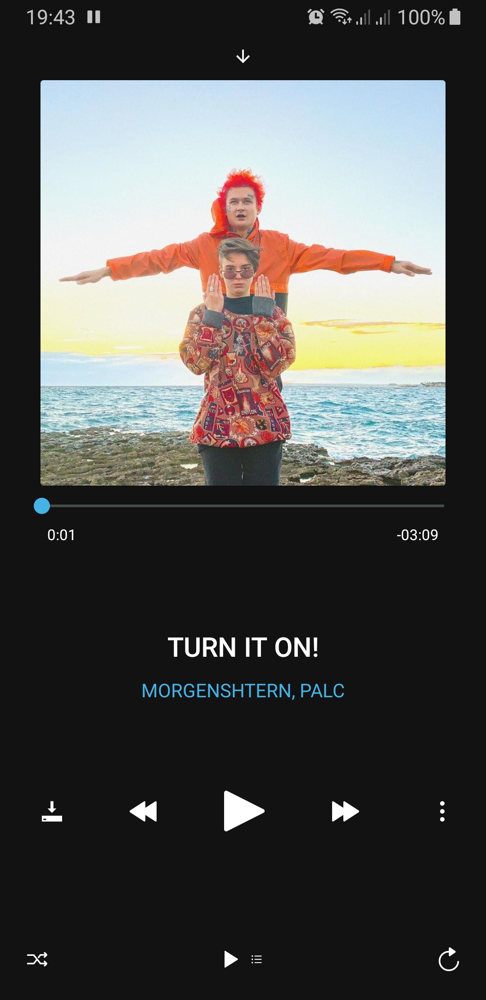
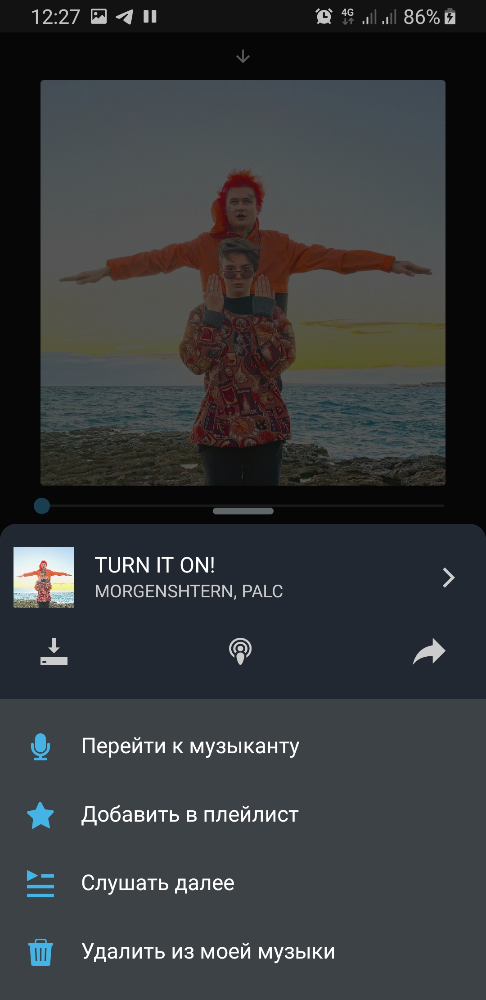
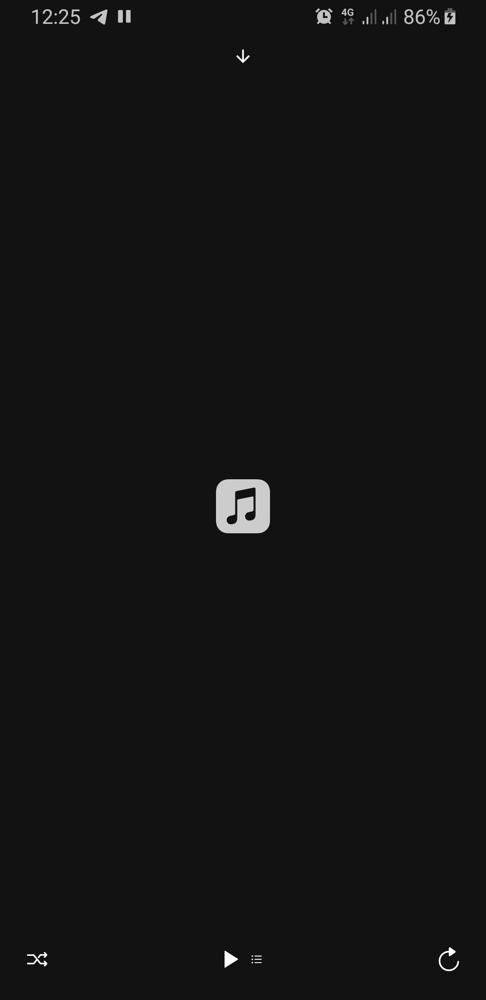
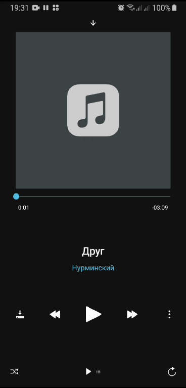
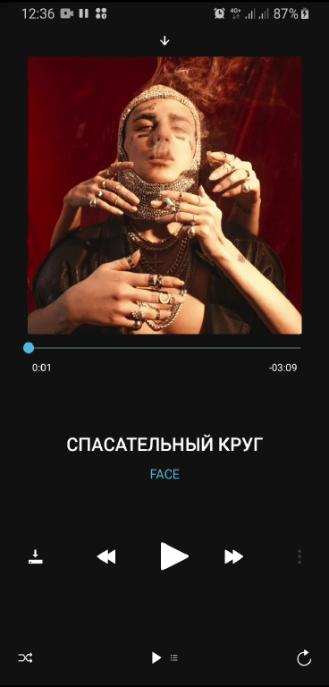

  
  <h5>Awesome music player & UI/UX for react native applications</h5>

### Presentation

Player | Playlist | ActonSheet | Empty | UI
--- | --- | --- | --- | ---
 |  |  |   |  

-- | -- | -- | --
--- | --- | --- | ---
 |  |  |   

### UI components

todo

### Installation

todo

### Example usage

Full example see `exampels` folder

### Features

### Props

### Events

