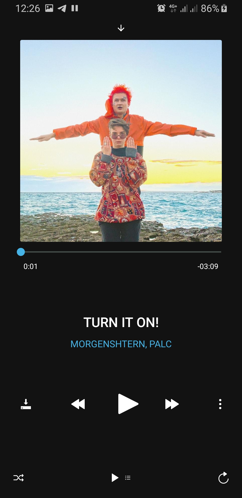
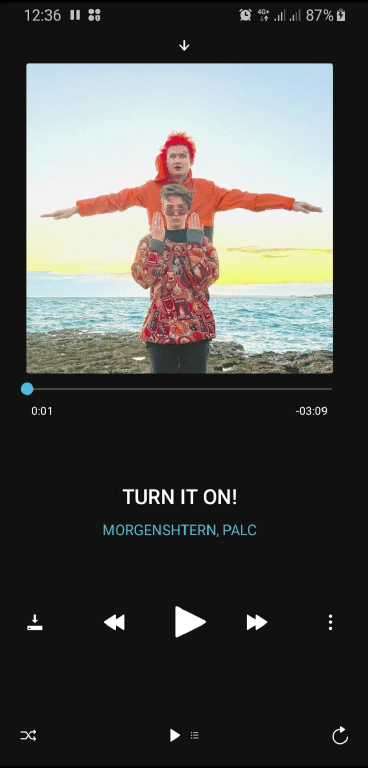

<div align="center">
  <h1>RePlayer*Music</h1>
  <h4>For React Native Apps</h4>
</div>

### Screenshots

Player | Playlist | ActonSheet | Empty
--- | --- | --- | ---
 |  |  |  

-- | -- | -- | --
--- | --- | --- | ---
 |  | coming soon |  coming soon


### Installation

todo

### Example usage

```js

import RePlayerMusic from 're-player-music';

...

const App = () => {
    const noop = () => alert('U clicked');

    const actionItems = [
        {
            title: 'Перейти к музыканту', icon: 'mic', onPress: noop
        },
        {
            title: 'Добавить в плейлист', icon: 'star', onPress: noop
        },
        {
            title: 'Слушать далее', icon: 'play-list', onPress: noop
        },
        {
            title: 'Удалить из моей музыки', icon: 'trash', onPress: noop
        },
    ];

    const playlist = [
        {
            id: 10, title: 'Друг', author: 'Нурминский', image: { uri: 'https://static.mp3xa.cc/album_images/400x400/nurminskijj-pacany-s-ulic-vybivajutsja-v-ljudi.jpg' }
        },
        {
            id: 10, title: 'ОСТАНУСЬ РАССВЕТОМ (feat. Dr. Shaman)', author: 'ФОГЕЛЬ feat. Dr. Shaman', image: { uri: 'https://img.zvuqa.net/albums/2/fogel-lyubol-pt-1.jpg' }
        },
        {
            id: 10, title: 'Вселенная (feat. DJ Mikis)', author: 'Леша Свик feat. DJ Mikis', image: { uri: 'https://freshall.com/img/2018-04/20/4gt8amfrm2w58jefu4jo3ehau.jpg' }
        },
        ...
    ];

    return (
        <RePlayerMusic
            colorScheme={'Dark'}
            actionItems={actionItems}
            items={playlist}
        />
    )
};

export default App;

```

### Features

### Props

### Events

